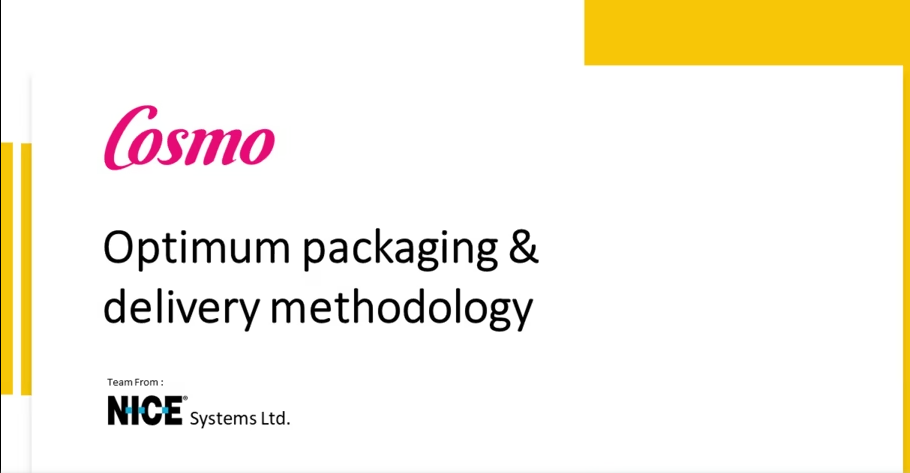
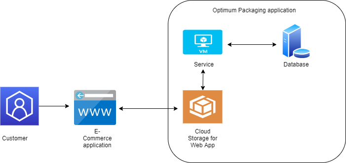
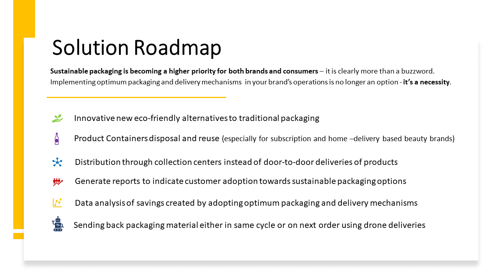

# Cosmo-Optimum Packaging and Delivery Methodology

## Contents

- [Submission or project name](#Cosmo-Optimum-Packaging-and-Delivery-Methodology)
  - [Contents](#contents)
  - [Short description](#short-description)
    - [What's the problem?](#whats-the-problem)
    - [How can technology help?](#how-can-technology-help)
    - [The idea](#the-idea)
  - [Demo video](#demo-video)
  - [The architecture](#the-architecture)
  - [Long description](#long-description)
  - [Project roadmap](#project-roadmap)
  - [Live demo](#live-demo)
  - [Built with](#built-with)
  - [Authors](#authors)

## Short description

### What's the problem?

E-commerce is increasing worldwide driving large amounts of plastic waste that gets generated due to excessive packaging of products. All the plastic waste that gets generated ends up at landfill sites, leading to a burden on the earth and damaging the environment. Do we really need the excessive packaging? Can we not do without it? 

### How can technology help?
Multiple simple practices can be followed to help reduce the amount to excessive packaging. Technology can provide a platform to help us monitor, track and reuse the discarded packaging.

### The idea

The idea is to provide the customer with an option to opt for optimized and sustainable delivery packaging. The customer can either choose to go package less or return the packaging to the vendor or a third party. The solution will provide a service to integrate with the client application and provide an option to opt for sustainable delivery.

## Demo video

## The architecture

1. The customer visits the e-commerce website, adds products to the cart and proceeds for checkout.
2. During checkout, the customer will have the option to choose sustainable packaging and delivery.
3. If the customer opts for sustainable packaging, on delivery of the products reward points will be credited to the customer wallet.

## Long description

[More detail is available here](./DESCRIPTION.md)

## Project roadmap

See below for our proposed road map for this solution.

## Live demo

You can find a running system to test at [cosmo-demo](https://enablepackagefree.s3.jp-tok.cloud-object-storage.appdomain.cloud/index.html).

## Built with

- [IBM Cloud Storage](https://www.ibm.com/in-en/cloud/storage) - For hosting Webapp
- [IBM Tool Chain](https://www.ibm.com/cloud/architecture/toolchains/) - To create pipeline and deploy application
- [Angular](https://angular.io/) - The web framework used
- [Node](https://nodejs.org/en/)

## Authors

